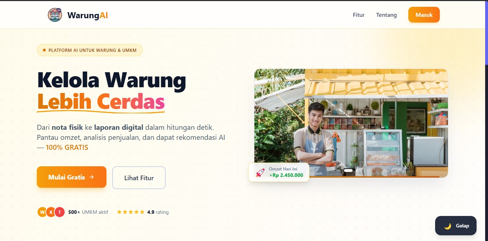
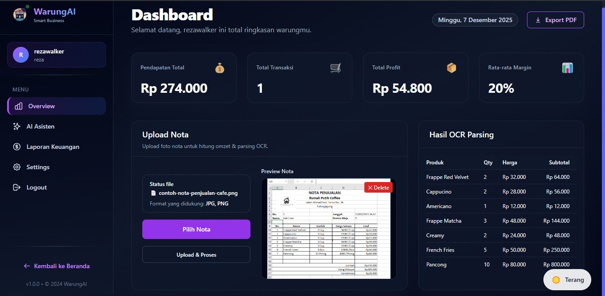

# WarungAI: AI-Powered Micro-Retail Management System

[](LICENSE)
[]()

## Overview




WarungAI is an open-source system designed to assist Micro, Small, and Medium Enterprises (MSMEs), especially traditional Indonesian shops. The project provides AI-assisted tools, including OCR-based receipt parsing and a modern dashboard interface.

This repository acts as the root project that links the **backend** and **frontend** codebases via Git Submodules.

---

## Demo Video

<div align="center">

[](https://www.youtube.com/watch?v=J5QUBdW2Qik)

</div>


---

## Repository Structure

The project is divided into two main components:

| Component | Stack                           | Repository                                                                                             |
| --------- | ------------------------------- | ------------------------------------------------------------------------------------------------------ |
| Backend   | NestJS, Bun, Prisma, PostgreSQL | [https://github.com/KanjutGusion/WarungAI-backend](https://github.com/KanjutGusion/WarungAI-backend)   |
| Frontend  | Nuxt 3, Vue 3, Tailwind CSS     | [https://github.com/KanjutGusion/WarungAI-frontend](https://github.com/KanjutGusion/WarungAI-frontend) |

Each component maintains its own development flow and documentation.

## Cloning the Project

Use recursive clone to include the submodules:

```bash
git clone --recurse-submodules https://github.com/KanjutGusion/WarungAI.git
cd WarungAI
```

If submodules are missing:

```bash
git submodule update --init --recursive
```

## Setting Up

Each component (backend and frontend) must be configured and run individually.

Environment setup, installation steps, and detailed documentation are available in their respective repositories.

## Documentation

For detailed instructions, API specifications, folder structures, and environment configuration, refer to the documentation within each repository:

* Backend: [https://github.com/KanjutGusion/WarungAI-backend](https://github.com/KanjutGusion/WarungAI-backend)
* Frontend: [https://github.com/KanjutGusion/WarungAI-frontend](https://github.com/KanjutGusion/WarungAI-frontend)

## License

Licensed under the MIT License.
